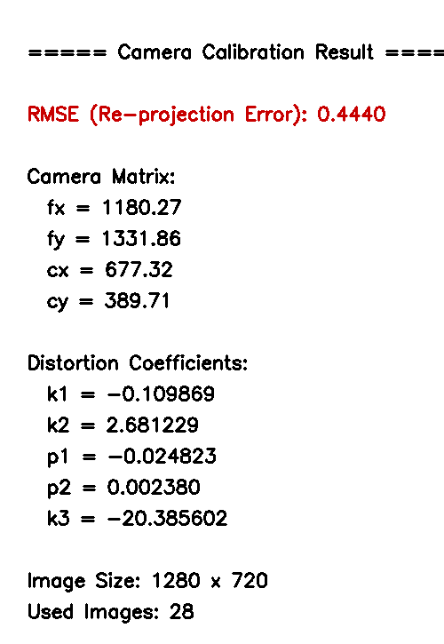
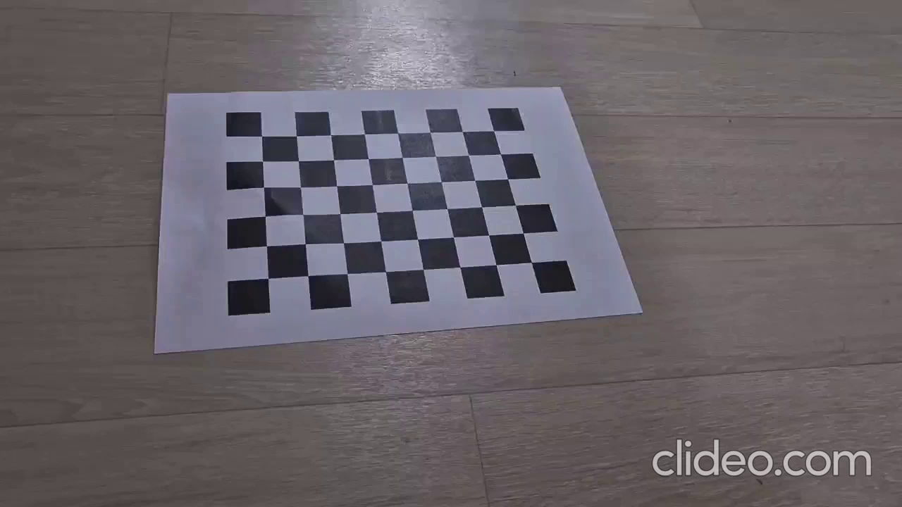
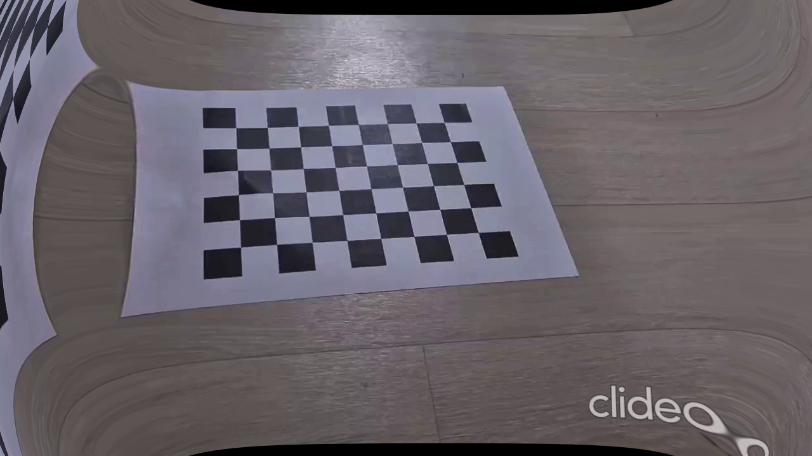

# 컴퓨터 비전 과제

## 목차
1. [Camera Calibration (카메라 캘리브레이션)](#1-camera-calibration)
2. [Lens Distortion Correction (렌즈 왜곡 보정)](#2-lens-distortion-correction)

---

## 1. Camera Calibration

### 개요
A4 용지에 출력한 체스보드 패턴을 다양한 각도에서 촬영한 동영상을 이용하여 카메라 내부 파라미터를 추정합니다.

### 사용 기법

| 단계 | 함수 | 역할 |
|------|------|------|
| 1 | `findChessboardCorners` | 체스보드 코너 검출 |
| 2 | `cornerSubPix` | 서브픽셀 정밀도 보정 |
| 3 | `calibrateCamera` | 카메라 행렬 + 왜곡 계수 추정 |

### 사용법
```bash
python Camera_Calibration.py
```
- 입력: `data/chessboard.avi` (체스보드 동영상)
- 출력: `Saved/calibration_result.png` (결과 이미지), `Saved/calibration_result.npz`

### 캘리브레이션 결과



| 파라미터 | 설명 |
|----------|------|
| fx, fy | 초점 거리 (focal length, pixel 단위) |
| cx, cy | 주점 (principal point) |
| k1, k2, k3 | 방사 왜곡 계수 (radial distortion) |
| p1, p2 | 접선 왜곡 계수 (tangential distortion) |
| RMSE | 재투영 오차 (낮을수록 정확) |

### 촬영 시 주의사항
1. 체스보드는 **평평한 면에 부착** (구부러지면 3D 좌표 오류)
2. 촬영 중 **카메라/보드 정지** (모션 블러 방지)
3. **10장 이상**, 다양한 각도와 위치에서 촬영
4. 체스보드가 **화면의 큰 비율**을 차지하도록
5. 카메라와 보드가 **완전히 평행한 각도만 피할 것**

---

## 2. Lens Distortion Correction

### 개요
Camera Calibration에서 구한 카메라 행렬과 왜곡 계수를 이용하여 렌즈 왜곡을 보정합니다.

### 사용 기법

| 함수 | 역할 |
|------|------|
| `getOptimalNewCameraMatrix` | 보정 후 최적 카메라 행렬 계산 |
| `undistort` | 이미지 왜곡 보정 |
| `initUndistortRectifyMap` + `remap` | 동영상 왜곡 보정 (속도 최적화) |

### 사용법
```bash
# 이미지 왜곡 보정
python Distortion_Correction.py test_photo.jpg

# 동영상 왜곡 보정
python Distortion_Correction.py data/chessboard.avi
```
- 출력: `Saved/{파일명}_undistorted.png` 또는 `Saved/{파일명}_undistorted.avi`

### 왜곡 보정 데모

| 보정 전 (Original) | 보정 후 (Undistorted) |
|---------------------|----------------------|
|  |  |

---

## 파일 구조
```
├── Camera_Calibration.py      # 카메라 캘리브레이션
├── Distortion_Correction.py   # 렌즈 왜곡 보정
├── README.md                  # 본 문서
├── data/
│   └── chessboard.avi         # 체스보드 촬영 동영상
└── Saved/                     # 결과 저장 폴더
    ├── calibration_result.png # 캘리브레이션 결과 이미지
    ├── calibration_result.npz # 캘리브레이션 데이터
    ├── distortion_before.png  # 왜곡 보정 전
    └── distortion_after.png   # 왜곡 보정 후
```
